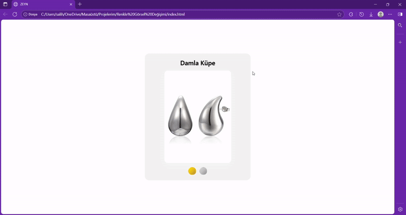

# 📍 E-Ticaret Ürün Kartı (Resim Değiştirici)

Bu proje, bir e-ticaret sitesi ürün sayfasının temel bir özelliğini simüle eder. Kullanıcı, "Gold" veya "Silver" renk butonlarına tıklayarak ürün görselini anında değiştirebilir.

Bu proje, `onclick` olaylarını kullanarak DOM'daki bir elementin `src` (kaynak) özelliğini dinamik olarak nasıl güncelleyeceğimizi gösterir.

*(Demo GIF'i, gold ve silver butonlarına tıklandığında küpe görselinin değiştiğini gösterir)*

---

### 🛠️ Kullanılan Teknolojiler

* **HTML5:** Ürün kartının ve butonların anlamsal (semantic) yapısı için.
* **CSS3:** Ürün kartına, resme ve özellikle gold/silver butonlarına modern bir görünüm kazandırmak için (flexbox, box-shadow, border-radius).
* **JavaScript (ES6+):**
    * Görseli seçmek için `getElementById("imageChange")`.
    * Tıklama olaylarını yönetmek için `onclick` fonksiyonları (`goldChange`, `silverChange`).
    * `imageShow.src` özelliğini güncelleyerek görseli değiştirmek.

---

### 📖 Bu Projeden Öğrendiklerim

* DOM'dan belirli bir elementi ID'si ile verimli bir şekilde seçmek.
* JavaScript fonksiyonlarını kullanarak HTML elementlerinin (`` etiketi) özelliklerini (attributes) değiştirmek.
* Temiz ve modern bir e-ticaret bileşeni (component) oluşturmak.